# DevOps Tooling Website Solution on AWS

## Project Overview

This project deploys the **Propitix Tooling Website** — a centralised web application that gives a DevOps team a single portal to access commonly used tools (Jenkins, Kubernetes, Artifactory, Rancher, Grafana, Prometheus, etc.). The infrastructure is built on AWS using a **3-Tier Architecture**:

- **3 stateless Web Servers** (RHEL 8) — Apache + PHP, all serving the same app
- **1 NFS Server** (RHEL 8) — shared file storage (`/var/www` and `/var/log/httpd`) for all Web Servers via LVM-backed XFS volumes
- **1 Database Server** (Ubuntu 24.04) — MySQL storing all application data

All three Web Servers mount `/var/www` and `/var/log/httpd` from the NFS server and connect to the same MySQL database. This makes them fully **stateless**: any server can be added, removed, or replaced without affecting the application or losing data. A single deployment to `/var/www/html` on any Web Server automatically applies to all three.

**Technologies Used:**

| Component | Details |
|---|---|
| Infrastructure | AWS EC2 |
| Web Server OS | Red Hat Enterprise Linux 8 |
| Database OS | Ubuntu Server 24.04 LTS |
| Storage Server OS | Red Hat Enterprise Linux 8 + NFS |
| Web Server Software | Apache (httpd) + PHP 7.4 |
| Database | MySQL |
| Programming Language | PHP |
| Code Repository | GitHub |

**Architecture:**

```
           Browser (Client)
                |
        ┌───────┼───────┐
        ↓       ↓       ↓
      WS-1    WS-2    WS-3       ← 3x Web Servers (RHEL 8, Apache+PHP)
        |       |       |
        └───────┼───────┘
                ↓
           DB Server             ← MySQL (Ubuntu 24.04)

        ↑       ↑       ↑
      WS-1    WS-2    WS-3
        └───────┼───────┘
                ↓
           NFS Server            ← Shared /var/www (RHEL 8)
```

---

## Phase 1: Provision and Configure the NFS Server

### 1.1 Launch the NFS Server EC2 Instance

**1.** Sign in to the **AWS Management Console** and navigate to **EC2** → **Instances** → click **Launch instances**.

**2.** In the **Name** field, enter `Project7-NFS`.

**3.** Under **Application and OS Images (Amazon Machine Image)**, click **Browse more AMIs** → search for `Red Hat Enterprise Linux 8` → select the **RHEL 8** AMI (64-bit x86).

> **Expected Output**: The AMI section shows "Red Hat Enterprise Linux 8" selected.

---

**4.** Under **Instance type**, select `t2.micro` (or `t3.micro` if t2.micro is unavailable in your region).

**5.** Under **Key pair (login)**, select your existing `.pem` key pair or create a new one. This is required to SSH into the instance.

**6.** Under **Network settings**, click **Edit**:
   - **VPC**: Leave as default
   - **Subnet**: Leave as default (note which subnet you are in — you will need its CIDR later)
   - **Auto-assign public IP**: Enable
   - **Firewall (Security groups)**: Create a new security group named `Project7-NFS-SG`
   - Add an **Inbound Rule**: Type = `SSH`, Protocol = `TCP`, Port = `22`, Source = `My IP`

**7.** Under **Configure storage**, you see the default 8 GiB root volume. Click **Add new volume** three times to add three additional EBS volumes:
   - Volume 1: `10 GiB`, `gp3`
   - Volume 2: `10 GiB`, `gp3`
   - Volume 3: `10 GiB`, `gp3`

> **Expected Output**: The storage section shows 4 volumes total — 1 root + 3 additional EBS volumes.

---

**8.** Click **Launch instance**. Wait until the instance **State** changes to `Running` and **Status checks** shows `2/2 checks passed`.

**9.** Click on the instance to view its details. Note:
   - **Public IPv4 address** (for SSH access)
   - **Private IPv4 address** (Web Servers will use this to mount NFS)

> **Expected Output**: NFS instance is `Running` with 2/2 status checks. Public and private IPs are visible.

---

### 1.2 SSH into the NFS Server

Open your terminal and connect using your `.pem` key:

```bash
ssh -i "your-key.pem" ec2-user@<NFS-Server-Public-IP>
```

> **Note**: On RHEL EC2 instances, the default username is `ec2-user`.

Once connected, update the system:

```bash
sudo yum -y update
```

> **Expected Output**: Terminal shows successful SSH login banner; `yum update` completes with `Complete!`.

---

### 1.3 Verify Attached Disks

Run `lsblk` to confirm the three additional EBS volumes are attached and visible to the OS:

```bash
lsblk
```

> **Device naming note**: On modern instance types (t3, t2 in some regions), EBS volumes appear as **NVMe devices** (`nvme0n1`, `nvme1n1`, `nvme2n1`, `nvme3n1`) rather than the traditional `xvda/xvdb/xvdc/xvdd` names. Your root volume is always the disk with partitions; the extra disks will have no partitions yet.

Expected output example (NVMe naming):
```
NAME        MAJ:MIN RM  SIZE RO TYPE MOUNTPOINTS
nvme1n1     259:0    0   10G  0 disk
nvme2n1     259:1    0   10G  0 disk
nvme3n1     259:2    0   10G  0 disk
nvme0n1     259:3    0   10G  0 disk
├─nvme0n1p1 259:4    0    1M  0 part
├─nvme0n1p2 259:5    0  200M  0 part /boot/efi
└─nvme0n1p3 259:6    0  9.8G  0 part /
```

> **If you only see 1 or 2 extra disks**: Some or all of the three additional EBS volumes were not successfully attached at launch. Go to **AWS Console → EC2 → Volumes**, find the volumes in **"Available"** state in the **same Availability Zone** as your instance, right-click each → **Attach Volume** → select your `Project7-NFS` instance → **Attach**. Then re-run `lsblk` to confirm all three appear.
> 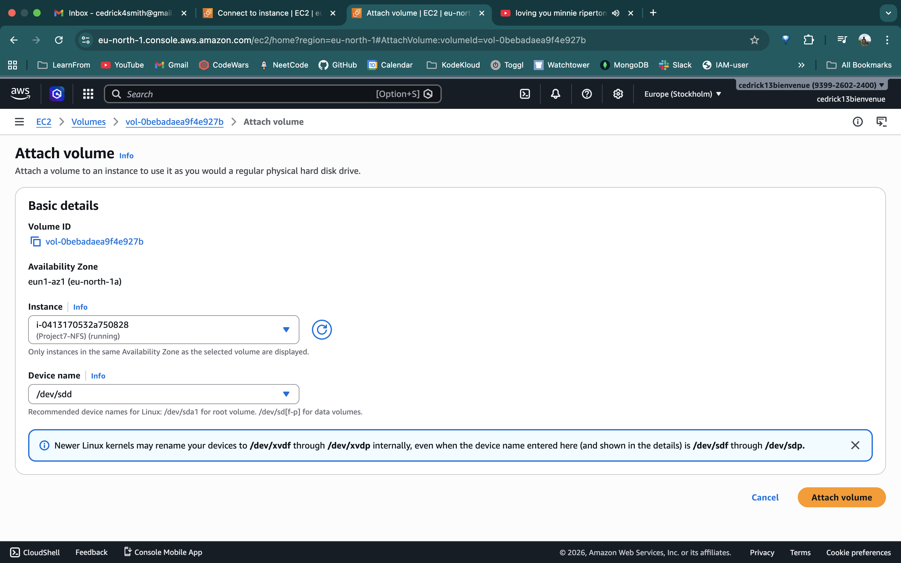

```bash
sudo df -h
```

> **Expected Output**: `lsblk` shows 4 disks total. The 3 extra disks have no mount points and no partitions.
> 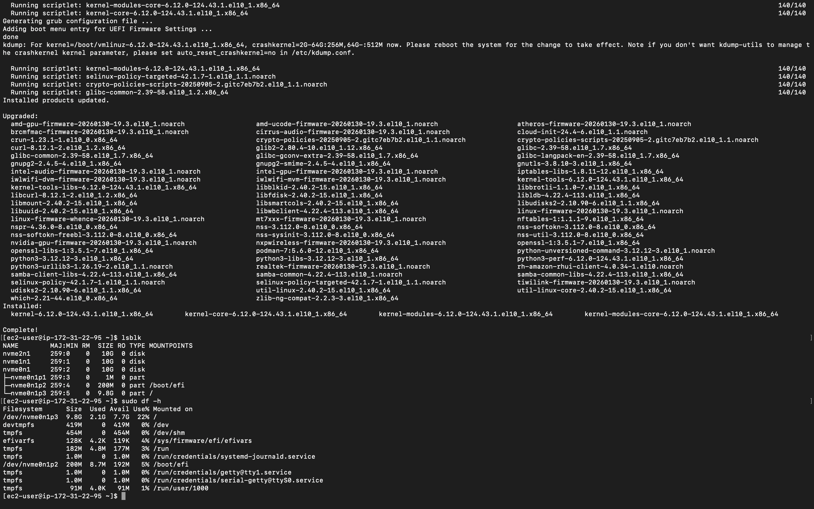

---

### 1.4 Configure LVM on the NFS Server

> **Important**: Unlike the previous WordPress project where volumes were formatted as `ext4`, this project uses **`xfs`** filesystem.

**Step 1 — Install LVM tools (if not present):**

```bash
sudo yum install lvm2 -y
```

**Step 2 — Create Physical Volumes on all three disks:**

> **Use the actual device names from your `lsblk` output.** On modern instance types the disks are NVMe devices. Replace `nvme1n1`, `nvme2n1`, `nvme3n1` with whatever your three extra disks are called (everything that is NOT the root disk with partitions).

```bash
sudo pvcreate /dev/nvme1n1 /dev/nvme2n1 /dev/nvme3n1
```

If you're on an older instance type that uses traditional naming, use:
```bash
sudo pvcreate /dev/xvdb /dev/xvdc /dev/xvdd
```

Expected output:
```
  Physical volume "/dev/nvme1n1" successfully created.
  Physical volume "/dev/nvme2n1" successfully created.
  Physical volume "/dev/nvme3n1" successfully created.
```

**Step 3 — Create a Volume Group named `webdata-vg`:**

```bash
# NVMe naming:
sudo vgcreate webdata-vg /dev/nvme1n1 /dev/nvme2n1 /dev/nvme3n1

# Traditional naming:
# sudo vgcreate webdata-vg /dev/xvdb /dev/xvdc /dev/xvdd

sudo vgs
```

**Step 4 — Create 3 Logical Volumes:**

```bash
sudo lvcreate -n lv-apps -L 9G webdata-vg   # For web server files
sudo lvcreate -n lv-logs -L 9G webdata-vg   # For web server logs
sudo lvcreate -n lv-opt  -L 9G webdata-vg   # For Jenkins (Phase 8)
sudo lvs
```

> **Expected Output**: `sudo lvs` shows `lv-apps`, `lv-logs`, and `lv-opt` each with ~9 GiB in `webdata-vg`.
> 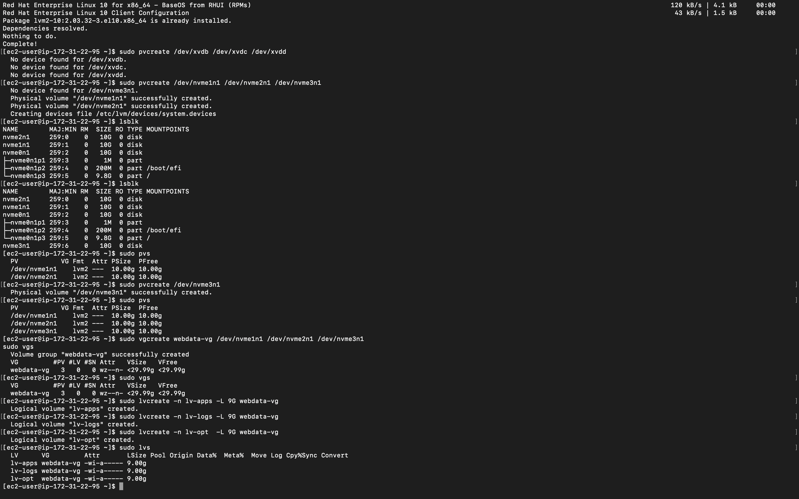

---

**Step 5 — Format all three Logical Volumes as `xfs`:**

```bash
sudo mkfs -t xfs /dev/webdata-vg/lv-apps
sudo mkfs -t xfs /dev/webdata-vg/lv-logs
sudo mkfs -t xfs /dev/webdata-vg/lv-opt
```

**Step 6 — Create mount point directories under `/mnt`:**

```bash
sudo mkdir -p /mnt/apps /mnt/logs /mnt/opt
```

**Step 7 — Mount the Logical Volumes:**

```bash
sudo mount /dev/webdata-vg/lv-apps /mnt/apps
sudo mount /dev/webdata-vg/lv-logs /mnt/logs
sudo mount /dev/webdata-vg/lv-opt  /mnt/opt
df -h
```

> **Expected Output**: `df -h` shows `/mnt/apps`, `/mnt/logs`, and `/mnt/opt` each mounted on their respective `xfs` logical volumes.
> 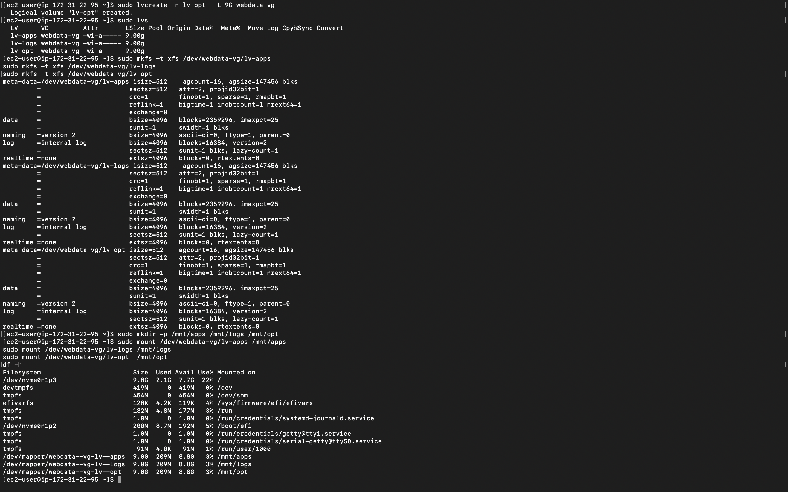

---

**Step 8 — Make mounts persistent across reboots via `/etc/fstab`:**

```bash
sudo blkid | grep webdata
```

Open `/etc/fstab` and add the three UUID entries (replace UUID values with your actual output from `blkid`):

```bash
sudo vi /etc/fstab
```

```
UUID=<lv-apps-uuid>  /mnt/apps  xfs  defaults  0 0
UUID=<lv-logs-uuid>  /mnt/logs  xfs  defaults  0 0
UUID=<lv-opt-uuid>   /mnt/opt   xfs  defaults  0 0
```

Save and exit (`:wq`), then verify:

```bash
sudo mount -a
sudo systemctl daemon-reload
df -h
```

> **Expected Output**: `mount -a` returns with no errors; `df -h` still shows all three volumes mounted.
> 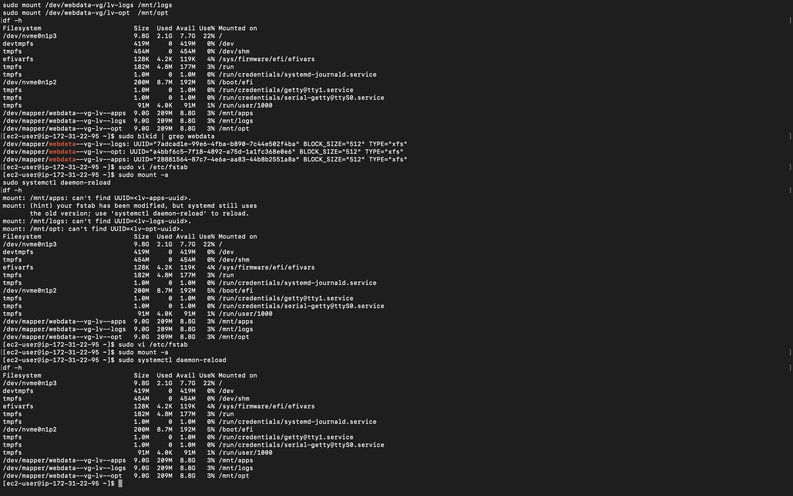

---

### 1.5 Install and Start the NFS Server

```bash
sudo yum install nfs-utils -y
sudo systemctl start nfs-server.service
sudo systemctl enable nfs-server.service
sudo systemctl status nfs-server.service
```

> **Expected Output**: `nfs-server.service` shows status `active (running)` and is enabled to start on boot.
> 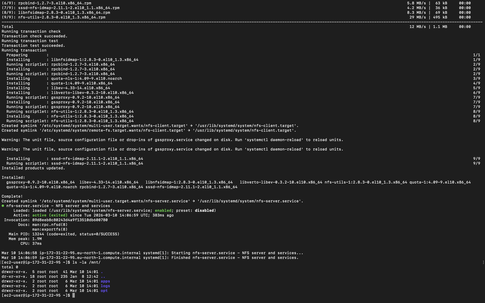

---

### 1.6 Set Ownership and Permissions on NFS Directories

The Web Servers need read, write, and execute permissions on the NFS shares:

```bash
sudo chown -R nobody: /mnt/apps
sudo chown -R nobody: /mnt/logs
sudo chown -R nobody: /mnt/opt

sudo chmod -R 777 /mnt/apps
sudo chmod -R 777 /mnt/logs
sudo chmod -R 777 /mnt/opt

sudo systemctl restart nfs-server.service
```

Confirm ownership:

```bash
ls -la /mnt/
```

> **Expected Output**: All three directories under `/mnt` are owned by `nobody:nobody` with `rwxrwxrwx` permissions.
> 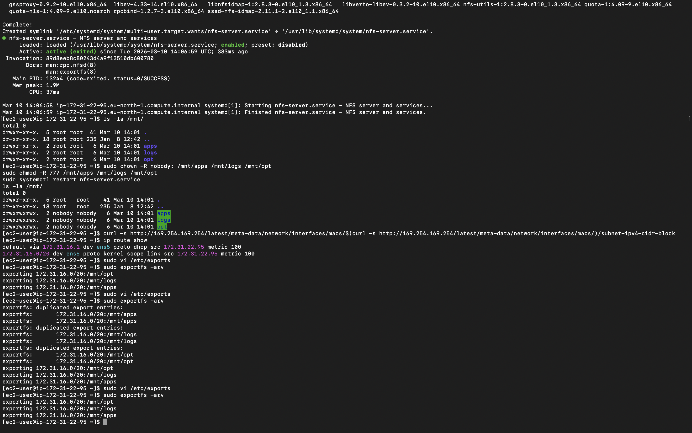

---

### 1.7 Configure NFS Exports

**Step 1 — Find your subnet CIDR:**

In the AWS EC2 console, click on your NFS instance → **Networking** tab → click the **Subnet ID** link → look for the **IPv4 CIDR** column. It will look something like `172.31.32.0/20`.

**Step 2 — Edit the NFS exports file:**

```bash
sudo vi /etc/exports
```

Add the following (replace `<Subnet-CIDR>` with your actual subnet CIDR, e.g. `172.31.32.0/20`):

```
/mnt/apps <Subnet-CIDR>(rw,sync,no_all_squash,no_root_squash)
/mnt/logs <Subnet-CIDR>(rw,sync,no_all_squash,no_root_squash)
/mnt/opt  <Subnet-CIDR>(rw,sync,no_all_squash,no_root_squash)
```

Save and exit (`:wq`).

**What these options mean:**
- `rw` — clients can read and write
- `sync` — writes are committed to disk before responding
- `no_all_squash` — preserve client user IDs
- `no_root_squash` — allow root on the client to act as root on the NFS share

**Step 3 — Apply the export configuration:**

```bash
sudo exportfs -arv
```

Expected output:
```
exporting 172.31.32.0/20:/mnt/opt
exporting 172.31.32.0/20:/mnt/logs
exporting 172.31.32.0/20:/mnt/apps
```

> **Expected Output**: `exportfs -arv` lists all three exported paths with your subnet CIDR.
> 

---

### 1.8 Open NFS Ports in the Security Group

**Step 1 — Check which port NFS is running on:**

```bash
rpcinfo -p | grep nfs
```

Expected output (NFS listens on **port 2049**):
```
100003   3   tcp  2049  nfs
100003   4   tcp  2049  nfs
100227   3   tcp  2049  nfs_acl
```

**Step 2 — Add Inbound Rules in AWS:**

Go to **EC2** → **Security Groups** → find `Project7-NFS-SG` → click **Edit inbound rules** → **Add rule** for each of the following, setting **Source** to your **subnet CIDR**:

| Type | Protocol | Port Range | Source |
|---|---|---|---|
| NFS | TCP | 2049 | `<Subnet-CIDR>` |
| Custom TCP | TCP | 111 | `<Subnet-CIDR>` |
| Custom UDP | UDP | 111 | `<Subnet-CIDR>` |
| Custom UDP | UDP | 2049 | `<Subnet-CIDR>` |

Click **Save rules**.

> **Expected Output**: `rpcinfo` shows port 2049; Security Group inbound rules show all four NFS-related rules.
> 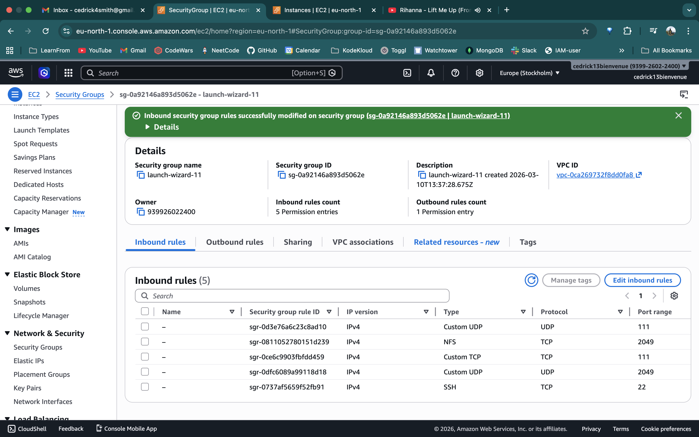

---

## Phase 2: Provision and Configure the Database Server

### 2.1 Launch the Database Server EC2 Instance

**1.** In the AWS EC2 console, click **Launch instances**.

**2.** Name it `Project7-DB`.

**3.** Under **AMI**, search for and select **Ubuntu Server 24.04 LTS** (64-bit x86).

**4.** Select **Instance type**: `t2.micro`.

**5.** Select your existing **Key pair**.

**6.** Under **Network settings** → **Edit**:
   - Keep the same VPC and Subnet as the NFS server (same subnet = same CIDR)
   - **Auto-assign public IP**: Enable
   - Create a new Security Group named `Project7-DB-SG`
   - Add inbound rules:
     - `SSH` → Port `22` → Source: `My IP`
     - `MySQL/Aurora` → Port `3306` → Source: `<Subnet-CIDR>` (so Web Servers on the same subnet can connect)

**7.** Keep default storage (8 GiB root). Click **Launch instance**.

> **Expected Output**: DB server instance is `Running` with 2/2 status checks; Security Group shows port 3306 open to subnet CIDR.

---

### 2.2 SSH into the Database Server

```bash
ssh -i "your-key.pem" ubuntu@<DB-Server-Public-IP>
```

> **Note**: On Ubuntu EC2 instances, the default username is `ubuntu`.

Update the system:

```bash
sudo apt update && sudo apt upgrade -y
```

---

### 2.3 Install MySQL Server

```bash
sudo apt install mysql-server -y
sudo systemctl enable --now mysql
sudo systemctl status mysql
```

> **Expected Output**: `mysql.service` is `active (running)` and enabled.
> 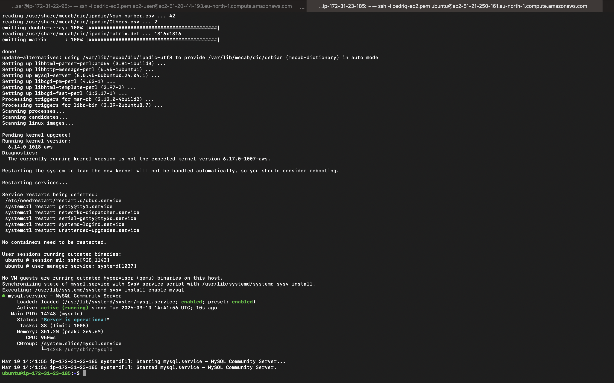

---

### 2.4 Configure MySQL to Accept Remote Connections

By default, MySQL only listens on `127.0.0.1`. Change the bind address so Web Servers can connect remotely.

```bash
sudo sed -i 's/bind-address.*/bind-address = 0.0.0.0/' /etc/mysql/mysql.conf.d/mysqld.cnf

# Verify the change
sudo grep bind-address /etc/mysql/mysql.conf.d/mysqld.cnf

# Restart MySQL to apply
sudo systemctl restart mysql
sudo systemctl status mysql
```

> **Expected Output**: `bind-address = 0.0.0.0`; `mysql.service` restarts and shows `active (running)`.
> 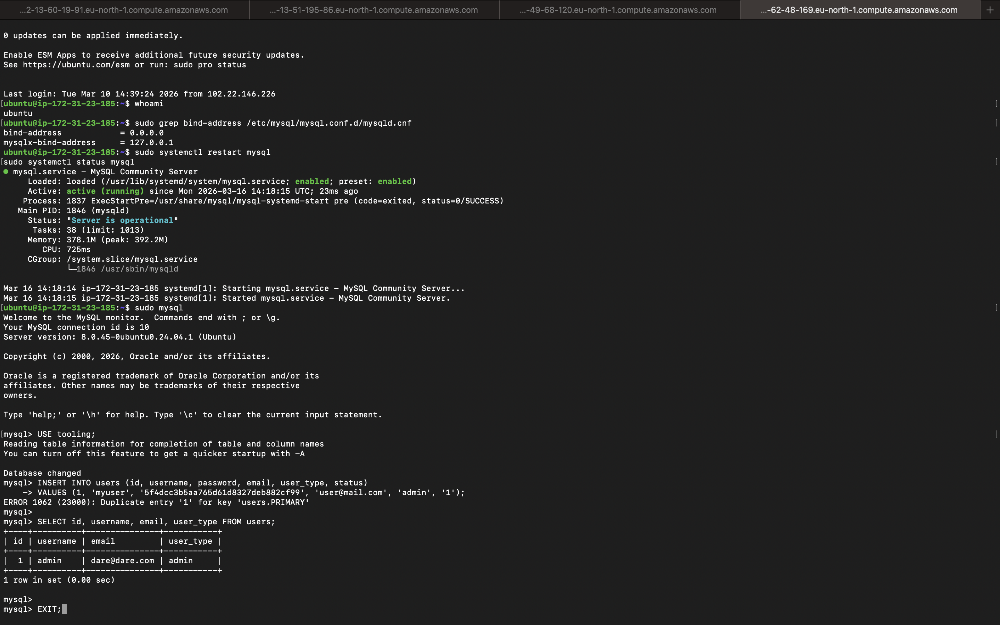

---

### 2.5 Create the Tooling Database and User

```bash
sudo mysql
```

Inside the MySQL shell, run the following SQL commands:

```sql
-- Create the application database
CREATE DATABASE tooling;

-- Create a dedicated user restricted to the Web Servers' subnet
CREATE USER 'webaccess'@'172.31.%' IDENTIFIED BY 'password';

-- Grant full privileges on the tooling database only
GRANT ALL PRIVILEGES ON tooling.* TO 'webaccess'@'172.31.%';

-- Apply privilege changes immediately
FLUSH PRIVILEGES;

-- Verify the database was created
SHOW DATABASES;

EXIT;
```

> **Note**: `'webaccess'@'172.31.%'` allows any host in the `172.31.x.x` range (your VPC) to connect.

> **Expected Output**: `SHOW DATABASES` lists `tooling`; each SQL statement returns `Query OK`.
> 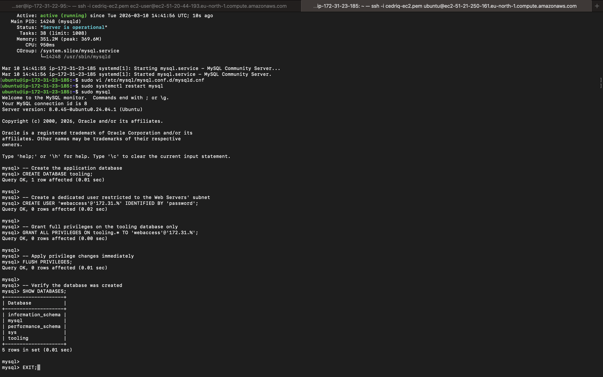

---

## Phase 3: Provision and Configure the Web Servers

Each of the three Web Servers must be configured identically. Launch all three instances first, then configure them one by one.

### 3.1 Launch Three Web Server EC2 Instances

**1.** In the AWS EC2 console, click **Launch instances**.

**2.** Under **Number of instances**, enter `3`.

**3.** Name them `Project7-Web` (AWS will append `-1`, `-2`, `-3`).

**4.** Under **AMI**, select **Red Hat Enterprise Linux 8** (same as the NFS server).

**5.** Select **Instance type**: `t2.micro`.

**6.** Select your existing **Key pair**.

**7.** Under **Network settings** → **Edit**:
   - Same VPC and Subnet as NFS and DB servers
   - **Auto-assign public IP**: Enable
   - Create a new Security Group named `Project7-Web-SG`
   - Add inbound rules:
     - `SSH` → Port `22` → Source: `My IP`
     - `HTTP` → Port `80` → Source: `0.0.0.0/0` (public web traffic)

**8.** Keep default storage (8 GiB root). Click **Launch instances**.

> **Expected Output**: Three Web Server instances are `Running` with 2/2 status checks each.
> 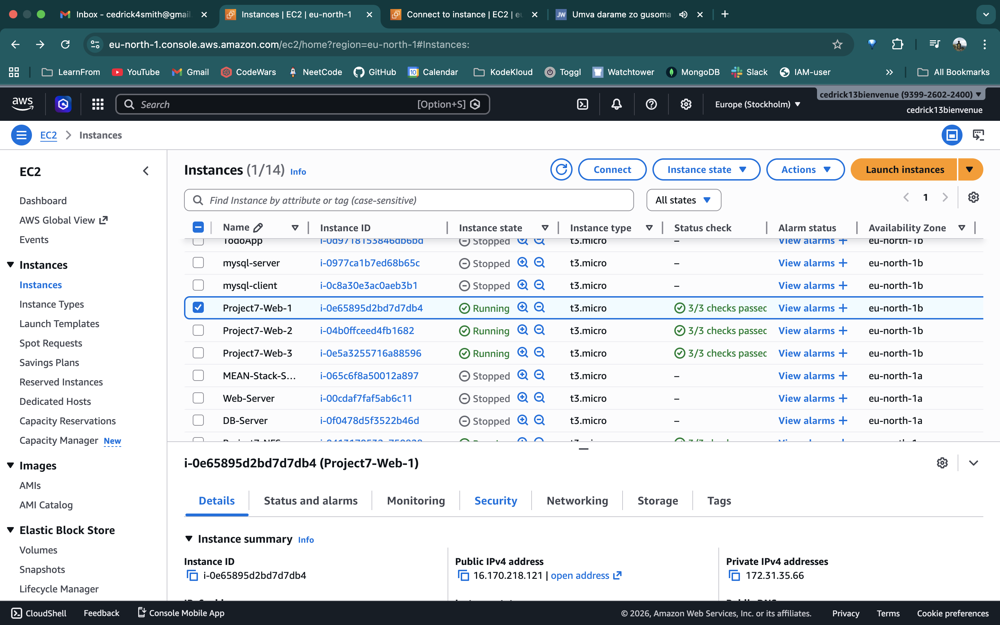

---

### 3.2 SSH into Web Server 1

```bash
ssh -i "your-key.pem" ec2-user@<WS-1-Public-IP>
```

---

### 3.3 Install NFS Client

```bash
sudo yum install nfs-utils nfs4-acl-tools -y
```

> **Expected Output**: `nfs-utils` and `nfs4-acl-tools` installed successfully with `Complete!`.
> 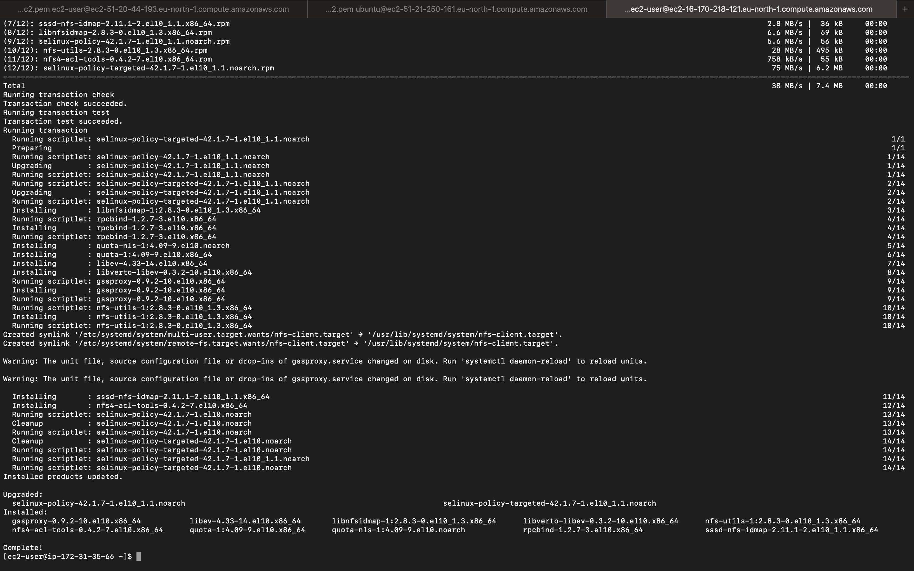

---

### 3.4 Mount the NFS Share to `/var/www`

This mounts the NFS server's `/mnt/apps` directory to the Web Server's `/var/www`, making both point to the same files.

```bash
# Create the target directory
sudo mkdir -p /var/www

# Mount the NFS export (replace <NFS-Server-Private-IP> with actual private IP)
sudo mount -t nfs -o rw,nosuid <NFS-Server-Private-IP>:/mnt/apps /var/www
```

Verify the mount is active:

```bash
df -h
```

You should see a line like:
```
172.31.x.x:/mnt/apps   9.0G  104M  8.9G   2% /var/www
```

**Make the mount persist after reboot:**

```bash
sudo vi /etc/fstab
```

Add this line at the bottom (replace with your NFS server's private IP):

```
<NFS-Server-Private-IP>:/mnt/apps /var/www nfs defaults 0 0
```

Save and exit.

> **Expected Output**: `df -h` shows `/var/www` mounted from the NFS server's private IP; `/etc/fstab` updated.
> 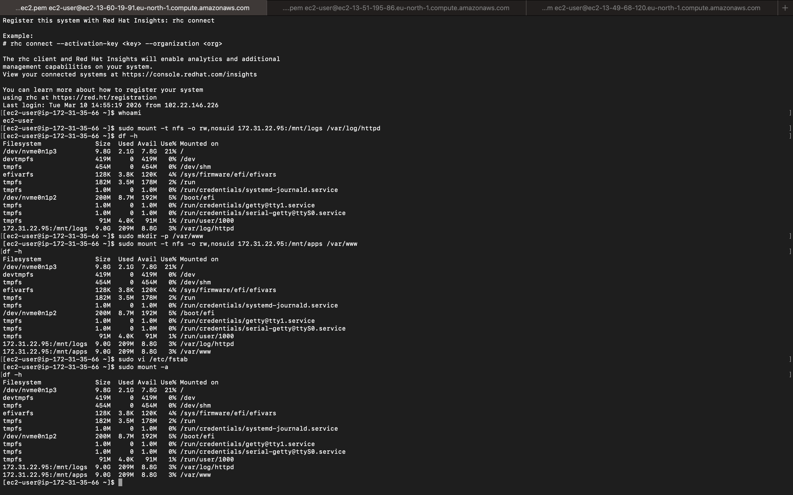

---

### 3.5 Install Apache and PHP 7.4 via Remi's Repository

RHEL 8's default repos only carry PHP 7.2. PHP 7.4 is needed from Remi's repo:

```bash
# Install Apache
sudo yum install httpd -y

# Install EPEL repository
sudo dnf install https://dl.fedoraproject.org/pub/epel/epel-release-latest-8.noarch.rpm -y

# Install Remi's repository
sudo dnf install dnf-utils http://rpms.remirepo.net/enterprise/remi-release-8.rpm -y

# Reset PHP module and enable PHP 7.4 from Remi
sudo dnf module reset php -y
sudo dnf module enable php:remi-7.4 -y

# Install PHP and required extensions for the tooling app
sudo dnf install php php-opcache php-gd php-curl php-mysqlnd -y

# Start and enable PHP-FPM (FastCGI Process Manager)
sudo systemctl start php-fpm
sudo systemctl enable php-fpm

# Allow Apache to execute memory-mapped files (required for PHP-FPM)
setsebool -P httpd_execmem 1
```

Start and enable Apache:

```bash
sudo systemctl start httpd
sudo systemctl enable httpd
sudo systemctl status httpd
```

> **Expected Output**: `httpd.service` and `php-fpm.service` both show as `active (running)` and enabled.
> 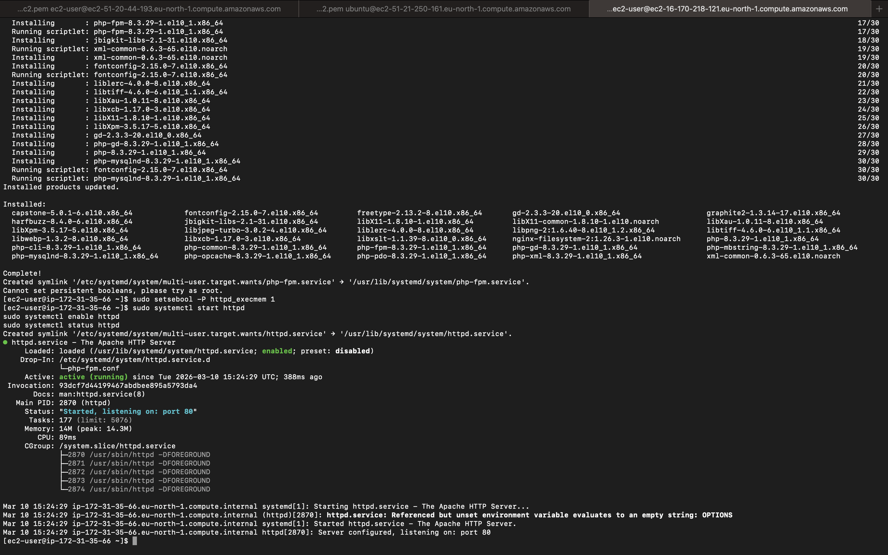
> 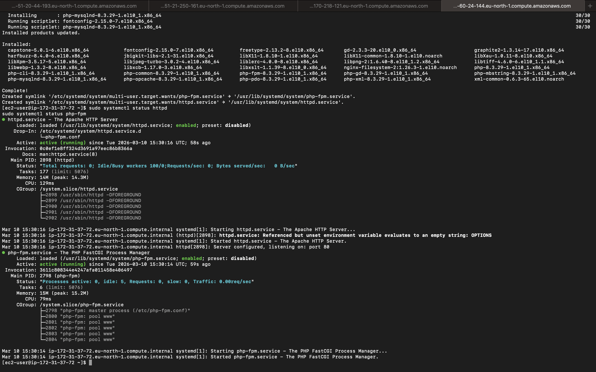
> 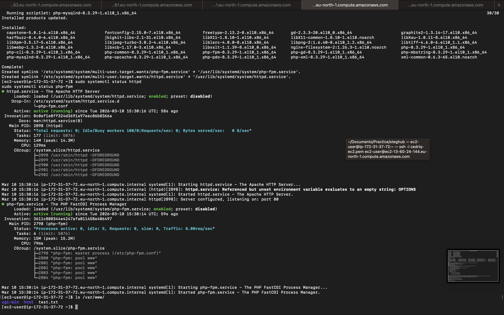

---

> **Troubleshooting — Apache fails with `Permission denied: could not open error log`**
>
> This happens when Apache was installed before the NFS mount was set up, or when SELinux blocks Apache from writing to the NFS-mounted `/var/log/httpd`. Run all three fixes on each Web Server:
>
> ```bash
> # 1. Create the document root if it does not exist yet
> sudo mkdir -p /var/www/html
>
> # 2. Disable SELinux enforcement and allow Apache to use NFS
> sudo setenforce 0
> sudo setsebool -P httpd_use_nfs on
>
> # 3. Fix permissions on the NFS-mounted log directory
> sudo chmod -R 777 /var/log/httpd
>
> # 4. Make SELinux permanently disabled so it survives reboots
> sudo sed -i 's/SELINUX=enforcing/SELINUX=disabled/' /etc/sysconfig/selinux
>
> # 5. Restart Apache
> sudo systemctl restart httpd
> sudo systemctl status httpd
> ```
>
> 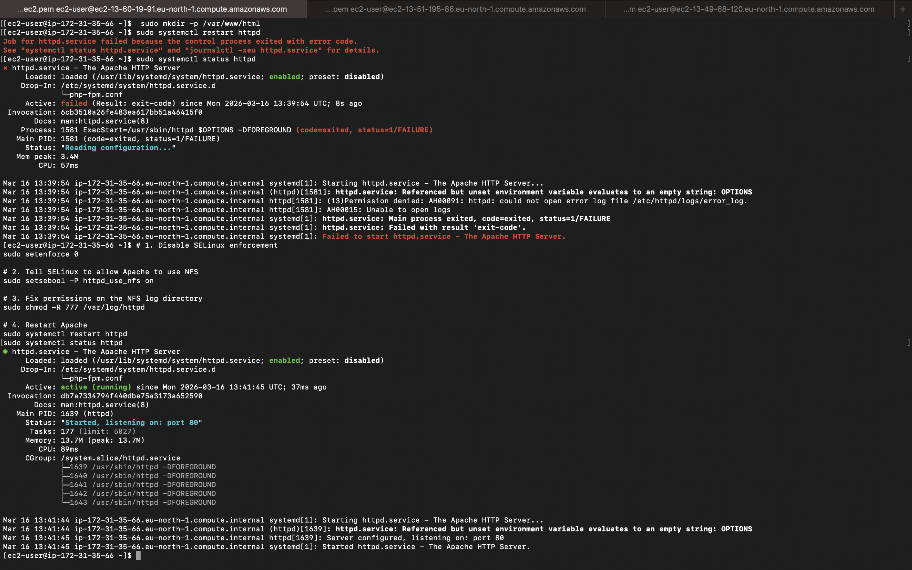
> 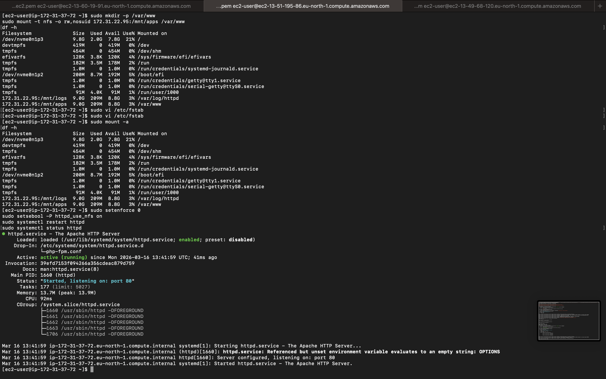
> 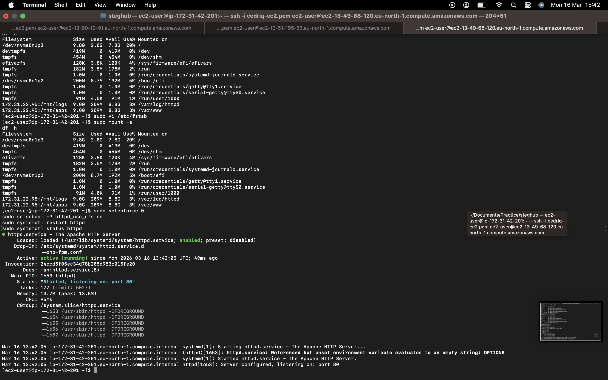

**Repeat steps 3.2 – 3.5 for Web Server 2 and Web Server 3** using their respective public IPs.

---

### 3.6 Verify NFS Shared Storage is Working

After configuring all three Web Servers, confirm they all share files through NFS.

On **Web Server 1**, check that Apache's default directory is visible:

```bash
ls /var/www
```

On the **NFS Server**, the same files should appear in `/mnt/apps`:

```bash
ls /mnt/apps
```

Test cross-server file sharing — create a file from Web Server 1, then check it from Web Server 2:

**On WS-1:**
```bash
touch /var/www/test.txt
ls /var/www/
```

**On WS-2 (new SSH session):**
```bash
ls /var/www/
# test.txt should be visible here too
```

**On NFS Server:**
```bash
ls /mnt/apps/
# test.txt should also be visible here
```

> **Expected Output**: `test.txt` created on WS-1 is immediately visible on WS-2 and on the NFS server's `/mnt/apps` — confirming NFS shared storage is working correctly.
> 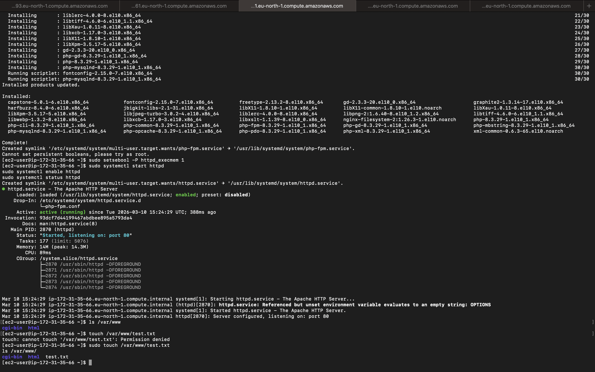

---

### 3.7 Mount Apache Log Directory to NFS

Centralise Apache logs from all three Web Servers by mounting `/var/log/httpd` to the NFS server's `/mnt/logs` export. **Repeat on all three Web Servers.**

```bash
sudo mount -t nfs -o rw,nosuid <NFS-Server-Private-IP>:/mnt/logs /var/log/httpd
```

Persist both NFS mounts in `/etc/fstab` (apps and logs):

```bash
sudo vi /etc/fstab
```

Add both lines (replace with your NFS server private IP):

```
<NFS-Server-Private-IP>:/mnt/apps  /var/www        nfs defaults 0 0
<NFS-Server-Private-IP>:/mnt/logs  /var/log/httpd  nfs defaults 0 0
```

Save and exit (`:wq`), then verify:

```bash
sudo mount -a
df -h
```

> **Expected Output**: `df -h` shows both `172.31.x.x:/mnt/apps` on `/var/www` and `172.31.x.x:/mnt/logs` on `/var/log/httpd` — confirmed on all three Web Servers.
> 
> 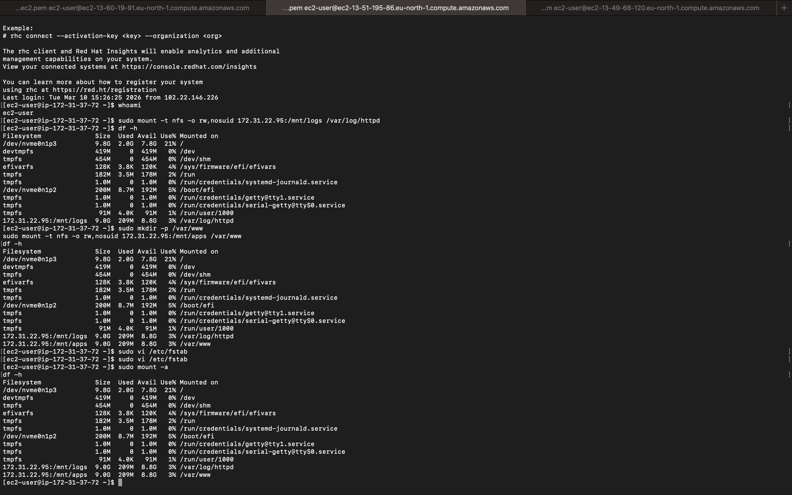
> 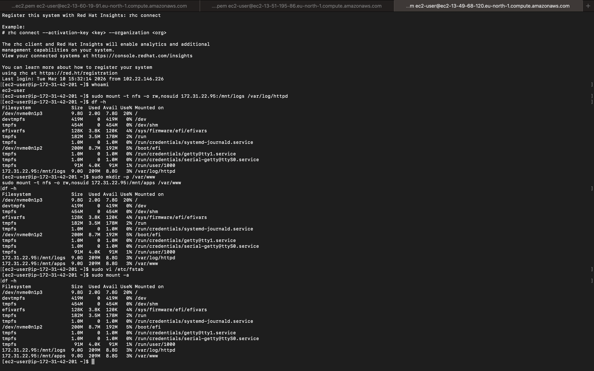

---

### 3.8 Fork and Deploy the Tooling Application

**Step 1 — Fork the repository:**

In your browser, go to:
```
https://github.com/StegTechHub/tooling
```
Click the **Fork** button (top-right) → select your own GitHub account → click **Create fork**. Your fork URL will be `https://github.com/<your-github-username>/tooling`.

**Step 2 — Install Git and clone your fork on Web Server 1 only:**

```bash
sudo yum install git -y
git clone https://github.com/<your-github-username>/tooling.git
```

> **Note**: Only do this on **WS-1**. Because `/var/www/html` is NFS-shared, the files will automatically appear on WS-2 and WS-3 as well.

**Step 3 — Deploy the application files to `/var/www/html`:**

```bash
sudo cp -R tooling/html/. /var/www/html/
ls /var/www/html/
```

You should see `index.php`, `login.php`, `functions.php`, `register.php`, `admin_tooling.php`, and other PHP files.

> **Expected Output**: Repository cloned; `cp -R` deploys all files; `ls /var/www/html` lists the full PHP application.
> 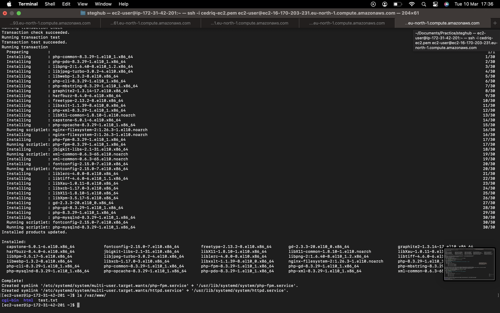
> 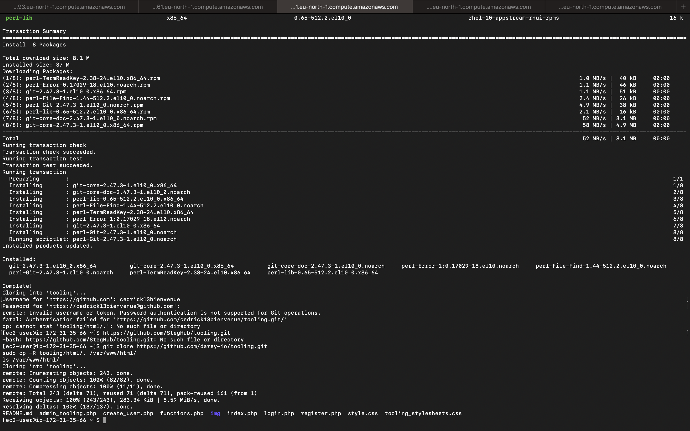
> 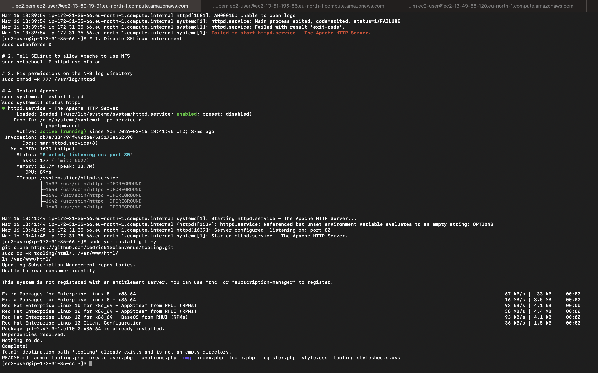

---

**Step 4 — Open TCP port 80** in the Web Server's Security Group if not already done.

**Step 5 — Disable SELinux** (if you encounter a 403 Forbidden error):

```bash
sudo setenforce 0
```

To make this permanent so it survives reboots:

```bash
sudo vi /etc/sysconfig/selinux
```

Find the line `SELINUX=enforcing` and change it to:

```
SELINUX=disabled
```

Then restart Apache:

```bash
sudo systemctl restart httpd
```

---

### 3.9 Configure the Database Connection

The tooling application uses `functions.php` to connect to MySQL. Update it with the DB server's **private IP** and the credentials created in Phase 2.

> **WS-1 only** — the file is on the NFS share so the change applies to all three servers automatically.

Find your DB server's private IP in the **AWS Console → EC2 → Instances → `Project7-DB` → Private IPv4 address**.

```bash
sudo vi /var/www/html/functions.php
```

Locate the `mysqli_connect` line — it looks like:

```php
$db = mysqli_connect('mysql.tooling.svc.cluster.local', 'admin', 'admin', 'tooling');
```

Replace it with your actual DB private IP and credentials:

```php
$db = mysqli_connect('<DB-Server-Private-IP>', 'webaccess', 'password', 'tooling');
```

Save and exit (`:wq`).

> **Expected Output**: `functions.php` updated with the correct DB server private IP, username `webaccess`, and database `tooling`.
> 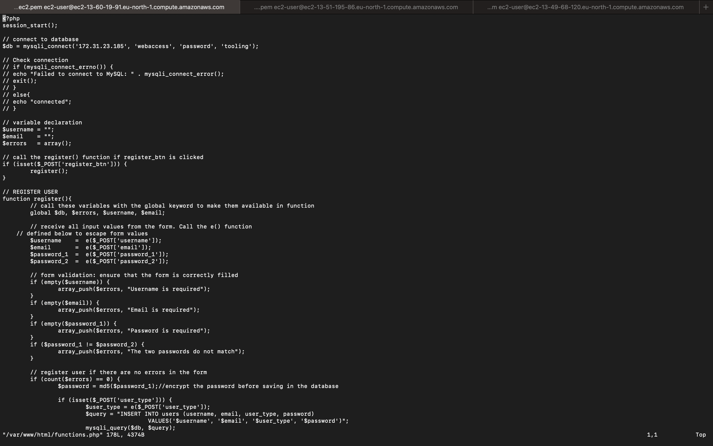

---

### 3.10 Apply the Tooling Database Schema

The repository includes `tooling-db.sql` that creates the required database tables. Apply it from **Web Server 1**.

> **RHEL 8 note**: The package `mysql` is not available in default RHEL 8 repos. Install `mariadb` instead — it provides the same `mysql` command-line client and is fully compatible.

```bash
# Install the MySQL-compatible client
sudo yum install mariadb -y

# Apply the schema — use -p flag inline to avoid the interactive password prompt
mysql -h <DB-Server-Private-IP> -u webaccess -ppassword tooling < ~/tooling/tooling-db.sql
```

> **Note**: There is **no space** between `-p` and `password` when passing the password inline.

Verify the tables were created:

```bash
mysql -h <DB-Server-Private-IP> -u webaccess -ppassword tooling -e "SHOW TABLES;"
```

Expected output:
```
+-------------------+
| Tables_in_tooling |
+-------------------+
| users             |
+-------------------+
```

> **Expected Output**: `tooling-db.sql` applies without errors; `SHOW TABLES` lists the `users` table.
> 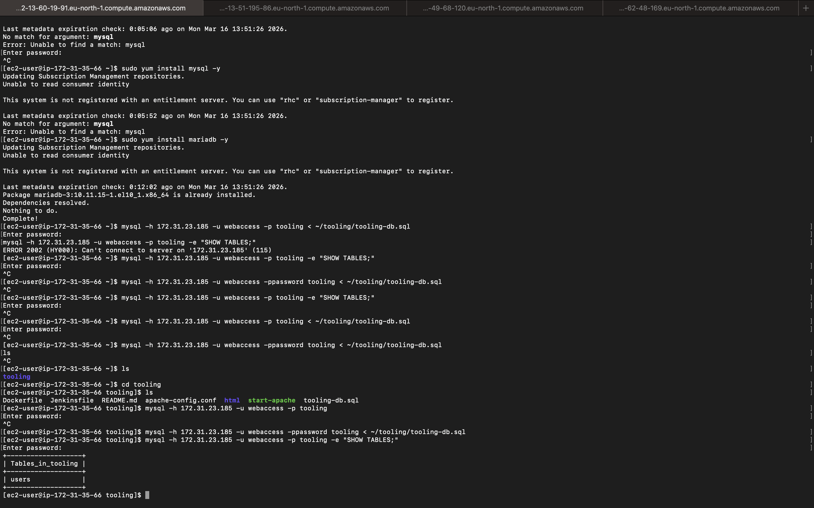

---

### 3.11 Create an Admin User in the Database

On the **DB Server**, log in to MySQL and verify or insert an admin user.

```bash
sudo mysql
```

```sql
USE tooling;

-- Check what users already exist (tooling-db.sql may have seeded one)
SELECT id, username, email, user_type FROM users;
```

> **Important**: If `tooling-db.sql` was applied successfully, an `admin` user with password `admin` (MD5: `21232f297a57a5a743894a0e4a801fc3`) is already present. You can log in with `admin` / `admin` immediately.

To add a second admin user (`myuser` / `password`), use the next available `id` (e.g. `2`) to avoid a duplicate key error:

```sql
INSERT INTO users (id, username, password, email, user_type, status)
VALUES (2, 'myuser', '5f4dcc3b5aa765d61d8327deb882cf99', 'user@mail.com', 'admin', '1');

SELECT id, username, email, user_type FROM users;

EXIT;
```

> **Note**: `5f4dcc3b5aa765d61d8327deb882cf99` is the MD5 hash of `password`. The tooling app authenticates using MD5.

> **Expected Output**: `SELECT` shows at least one admin user (`admin` or `myuser`) in the `users` table.
> 

---

## Phase 4: Final Verification

### 4.1 Access the Tooling Website

Get the **public IP** of any Web Server from the AWS EC2 console and open it in your browser:

```
http://<Web-Server-Public-IP>/index.php
```

You should see the **Propitix Tooling Website login page**.

> **If you see a 403 Forbidden error** — run on the web server:
> ```bash
> sudo setenforce 0
> sudo chmod -R 755 /var/www/html
> sudo systemctl restart httpd
> ```

> **Expected Output**: The tooling website login page loads with a username and password form.

---

### 4.2 Log In and Verify the Dashboard

The default credentials seeded by `tooling-db.sql` are:
- **Username**: `admin`
- **Password**: `admin`

Or if you inserted `myuser` manually:
- **Username**: `myuser`
- **Password**: `password`

Click **Login**.

> **Expected Output**: Successful authentication — the **Propitix Tooling Website** dashboard loads showing DevOps tools: Jenkins, Kubernetes, Grafana, Prometheus, Rancher, and more.
> 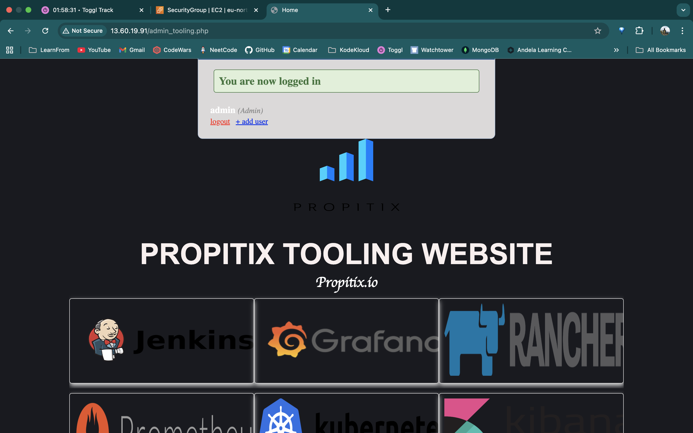

---

### 4.3 Verify Multi-Server Redundancy

Open the website using **each** Web Server's public IP to confirm all three serve identical content:

```
http://<WS-1-Public-IP>/index.php
http://<WS-2-Public-IP>/index.php
http://<WS-3-Public-IP>/index.php
```

Log in on each — the same dashboard should appear on all three, because every server reads from the same NFS share (`/var/www`) and the same MySQL database.

> **Expected Output**: All three Web Servers serve identical content — confirming the stateless, shared-storage architecture is working correctly.

---

## Summary

The Propitix Tooling Website solution is fully operational:

| Component | Instance Name | Role | OS |
|---|---|---|---|
| NFS Server | `Project7-NFS` | LVM (XFS) + NFS shared storage | RHEL 8 |
| Database Server | `Project7-DB` | MySQL — `tooling` DB, `webaccess` user | Ubuntu 24.04 |
| Web Server 1 | `Project7-Web-1` | Apache + PHP 7.4 (Remi) | RHEL 8 |
| Web Server 2 | `Project7-Web-2` | Apache + PHP 7.4 (Remi) | RHEL 8 |
| Web Server 3 | `Project7-Web-3` | Apache + PHP 7.4 (Remi) | RHEL 8 |

**Key architectural achievements:**
- All three Web Servers share `/var/www` from NFS — one `git clone` + `cp` deploys to all three
- Apache logs from all Web Servers are centralised in NFS `/mnt/logs` — single log location
- The `/mnt/opt` NFS share is reserved for a future Jenkins installation
- Web Servers are fully **stateless** — add or remove any one at any time without data loss

**Key lessons from this implementation:**
- On RHEL 8, the MySQL client package is `mariadb`, not `mysql`
- When `/var/log/httpd` is NFS-mounted, Apache requires `setsebool -P httpd_use_nfs on` and `setenforce 0` to start successfully
- The `tooling-db.sql` schema seeds an `admin`/`admin` user automatically — use `id=2` when inserting additional users to avoid a duplicate primary key error
- Pass the MySQL password inline (`-ppassword`) to avoid the interactive prompt blocking automation

---
